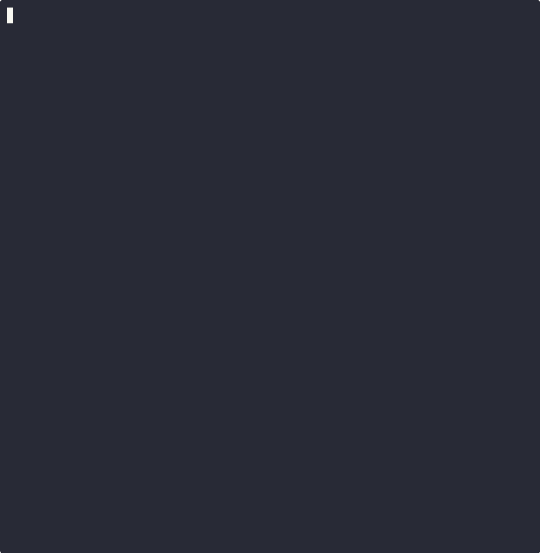

<p align="center">
  <h1 align="center">🧶 StateWeave</h1>
  <p align="center"><strong><code>git</code> for agent brains.</strong></p>
  <p align="center"><em>When your agent goes wrong, see exactly where and why. Then rewind.</em></p>
  <p align="center">
    <a href="https://pypi.org/project/stateweave/"></a>
    <a href="https://github.com/GDWN-BLDR/stateweave/actions"></a>
    <a href="https://github.com/GDWN-BLDR/stateweave/blob/main/LICENSE"></a>
    <a href="https://www.python.org/downloads/"></a>
  </p>
</p>

---

<!-- mcp-name: stateweave -->

**StateWeave** is `git` for agent brains — debug, time-travel, and migrate agent state across 10 frameworks. When a 20-step autonomous workflow derails at step 15, see exactly what changed, rewind to step 14, and replay. Export from LangGraph, import into CrewAI with zero data loss. Checkpoint, rollback, diff, encrypt, sign — all through a single Universal Schema.

When your agent hallucinates, crashes, or drifts — `stateweave why` shows you the exact state transition that went wrong. When your enterprise needs to audit agent behavior, every state change is versioned, signed, and encrypted.

## Why StateWeave?

StateWeave solves three critical problems in the AI agent ecosystem:

🔍 **Debugging** — Agent workflows are non-deterministic. When they go wrong, you need to pause, rewind, inspect, and replay — not restart. `stateweave why` shows you the exact state transition that caused the failure. Version control for agent cognition.

🔒 **Security** — Agent state contains the agent's entire cognitive history. StateWeave encrypts at rest (AES-256-GCM), signs payloads (Ed25519), strips credentials on export, and enforces compliance policies.

🔄 **Portability** — Every framework has persistence, none have portability. StateWeave's **Universal Schema** — a canonical representation of agent cognitive state — lets you move state between any of 10 frameworks. One schema, N adapters, zero data loss (with explicit warnings for anything non-portable).

```
┌─────────────┐     ┌─────────────┐     ┌─────────────┐     ┌─────────────┐
│  LangGraph  │     │    MCP      │     │   CrewAI    │     │   AutoGen   │
│   Adapter   │     │   Adapter   │     │   Adapter   │     │   Adapter   │
└──────┬──────┘     └──────┬──────┘     └──────┬──────┘     └──────┬──────┘
       │                   │                   │                   │
       └───────────┬───────┴───────────┬───────┘                   │
                   │                   │                           │
                   ▼                   ▼                           ▼
            ┌──────────────────────────────────────────────────────────┐
            │              🧶  Universal Schema v1                     │
            │                                                          │
            │  conversation_history  ·  working_memory  ·  goal_tree   │
            │  tool_results_cache  ·  trust_parameters  ·  audit_trail │
            └──────────────────────────────────────────────────────────┘
```

**Star topology, not mesh.** N adapters, not N² translation pairs. Adding a new framework = one adapter, instant compatibility with everything else.

### See it working

<p align="center">
  
</p>

```
$ pip install stateweave
$ python examples/full_demo.py

━━ 1. Export from LangGraph ━━
  ✓ Exported 4 messages
  ✓ Source framework: langgraph

━━ 2. Import into MCP ━━
  ✓ Imported into mcp
  ✓ Messages preserved: 4

━━ 3. Verify Round-Trip ━━
  ✓ Zero data loss: YES

━━ 4. Diff Agent States ━━
  Summary: 7 added, 4 removed, 7 modified

━━ 5. Time Travel ━━
  ✓ Checkpoint v1 (initial-research)
  ✓ Checkpoint v2 (after-drug-discovery)
  ✓ Rolled back → 4 msgs

━━ 6. Encryption (AES-256-GCM) ━━
  ✓ 1,733 bytes → 1,749 bytes encrypted
  ✓ Decrypted: 4 messages intact

━━ 7. Non-Portable Warnings ━━
  ✓ No non-portable warnings (clean export)

7/7 steps passed. Everything runs from PyPI.
```

> **Try it now:** `pip install stateweave && stateweave quickstart` — zero-code demo in 10 seconds.
>
> Or run the full 7-step demo: `python examples/full_demo.py`

### One-Command Migration

```bash
$ stateweave migrate --from langgraph --to crewai --agent my-agent

  🧶 StateWeave Migrate: langgraph → crewai
  ════════════════════════════════════════════════

  ━━ Step 1: Export from langgraph ━━
    ✓ Exported 12 messages, 5 memory keys (0.01s)

  ━━ Step 2: Validate payload ━━
    ✓ Payload valid — all schema checks passed

  ━━ Step 3: Import into crewai ━━
    ✓ Imported into crewai (0.00s)

  ━━ Step 4: Verify round-trip ━━
    ✓ Messages: 12 → 12 (zero loss)
    ✓ Memory keys: 5 → 5 (zero loss)

  ────────────────────────────────────────────────
  ✅ Migration complete: langgraph → crewai (0.01s)
```

### One-Line Auto-Instrumentation

```python
import stateweave
stateweave.auto()  # That's it. Auto-checkpoint + confidence alerts + session summary.
```

### git-Style CLI

```bash
stateweave log my-agent           # Beautiful checkpoint history with confidence sparkline
stateweave blame my-agent confidence  # Which checkpoint changed confidence? Value history.
stateweave stash my-agent         # Save current state (like git stash)
stateweave pop my-agent           # Restore stashed state
stateweave replay my-agent        # Step-by-step state debugger
stateweave watch                  # Live agent health dashboard (htop for agent brains)
stateweave ci my-agent            # CI regression detection — exits non-zero on failure
```

## Quick Start

### Install

```bash
pip install stateweave
```

### Use with Claude Desktop / Cursor

Add to your MCP config (`~/.cursor/mcp.json` or Claude Desktop settings):

```json
{
  "mcpServers": {
    "stateweave": {
      "command": "python3",
      "args": ["-m", "stateweave.mcp_server"]
    }
  }
}
```

Claude and Cursor can now export, import, and diff your agent state directly.

### Export an Agent's State

```python
from stateweave import LangGraphAdapter, MCPAdapter, diff_payloads

# Set up a LangGraph agent with some state
lg = LangGraphAdapter()
lg._agents["my-agent"] = {
    "messages": [
        {"type": "human", "content": "What's the weather?"},
        {"type": "ai", "content": "It's 72°F and sunny!"},
    ],
    "current_task": "weather_check",
}

# Export from LangGraph
payload = lg.export_state("my-agent")
print(f"Exported: {len(payload.cognitive_state.conversation_history)} messages")
```

### Import into Another Framework

```python
from stateweave import MCPAdapter

# Import into MCP
mcp_adapter = MCPAdapter()
mcp_adapter.import_state(payload)

# The agent resumes with its memories intact
```

### Auto-Checkpoint Middleware

```python
from stateweave.middleware import auto_checkpoint

# Simple: checkpoint every 5 steps
@auto_checkpoint(every_n_steps=5)
def run_agent(payload):
    return payload

# Smart: only checkpoint on significant state changes
@auto_checkpoint(strategy="on_significant_delta", delta_threshold=3)
def smart_agent(payload):
    return payload

# Manual: zero overhead, checkpoint when you decide
@auto_checkpoint(strategy="manual_only")
def hot_path_agent(payload):
    return payload
```

### Migrate with Encryption

```python
from stateweave import EncryptionFacade, MigrationEngine

# Set up encrypted migration
key = EncryptionFacade.generate_key()
engine = MigrationEngine(
    encryption=EncryptionFacade(key)
)

# Full pipeline: export → validate → encrypt → transport
result = engine.export_state(
    adapter=langgraph_adapter,
    agent_id="my-agent",
    encrypt=True,
)

# Decrypt → validate → import on the other side
engine.import_state(
    adapter=mcp_adapter,
    encrypted_data=result.encrypted_data,
    nonce=result.nonce,
)
```

### Diff Two States

```python
from stateweave import diff_payloads

diff = diff_payloads(state_before, state_after)
print(diff.to_report())
# ═══════════════════════════════════════════════
# 🔍 STATEWEAVE DIFF REPORT
# ═══════════════════════════════════════════════
#   Changes: 5 (+2 -1 ~2)
#   [working_memory]
#     + working_memory.new_task: 'research'
#     ~ working_memory.confidence: 0.7 → 0.95
```

## Framework Support

| Framework | Adapter | Export | Import | Tier |
|-----------|---------|:------:|:------:|------|
| **LangGraph** | `LangGraphAdapter` | ✅ | ✅ | 🟢 Tier 1 |
| **MCP** | `MCPAdapter` | ✅ | ✅ | 🟢 Tier 1 |
| **CrewAI** | `CrewAIAdapter` | ✅ | ✅ | 🟢 Tier 1 |
| **AutoGen** | `AutoGenAdapter` | ✅ | ✅ | 🟢 Tier 1 |
| **DSPy** | `DSPyAdapter` | ✅ | ✅ | 🟡 Tier 2 |
| **OpenAI Agents** | `OpenAIAgentsAdapter` | ✅ | ✅ | 🟡 Tier 2 |
| **LlamaIndex** | `LlamaIndexAdapter` | ✅ | ✅ | 🔵 Community |
| **Haystack** | `HaystackAdapter` | ✅ | ✅ | 🔵 Community |
| **Letta / MemGPT** | `LettaAdapter` | ✅ | ✅ | 🔵 Community |
| **Semantic Kernel** | `SemanticKernelAdapter` | ✅ | ✅ | 🔵 Community |
| Custom | Extend `StateWeaveAdapter` | ✅ | ✅ | DIY |

> **Tier definitions:** 🟢 **Tier 1** = Core team maintained, guaranteed stability. 🟡 **Tier 2** = Actively maintained, patches may lag. 🔵 **Community** = Best-effort, contributed by community.

## Debug Agent Failures

When your agent hallucinates, crashes, or drifts — `stateweave why` shows you exactly what happened:

```bash
$ stateweave why my-agent

🔍 StateWeave Autopsy: my-agent
══════════════════════════════════════════
  Checkpoints: 5 versions
  Latest: v5 (2026-03-20 14:23:01)

📊 State Evolution
──────────────────────────────────────────
  v1 → v2: 3 changes (+2 added, ~1 modified)
  v2 → v3: 7 changes (+4 added, ~2 modified, -1 removed)  ← BIGGEST
  v3 → v4: 1 change (~1 modified)
  v4 → v5: 2 changes (+1 added, ~1 modified)

🩺 Diagnosis
  Biggest change: v2 → v3 (7 changes)
  Label: after-tool-failure
  💡 Recommendation: stateweave rollback my-agent 2
```

Then rollback and continue:

```python
from stateweave.core.timetravel import CheckpointStore

store = CheckpointStore()
restored = store.rollback("my-agent", version=2)
# Agent brain restored to pre-failure state
```

> See the full demo: `python examples/viral_demo.py`

## MCP Server

StateWeave ships as an MCP Server — any MCP-compatible AI assistant can use it directly.

### Tools

| Tool | Description |
|------|-------------|
| `export_agent_state` | Export an agent's cognitive state from any supported framework |
| `import_agent_state` | Import state into a target framework with validation |
| `diff_agent_states` | Compare two states and return a detailed change report |

### Resources

| Resource | URI |
|----------|-----|
| Universal Schema spec | `stateweave://schemas/v1` |
| Migration history log | `stateweave://migrations/history` |
| Live agent snapshot | `stateweave://agents/{id}/snapshot` |

### Prompts

| Prompt | Use Case |
|--------|----------|
| `backup_before_risky_operation` | Agent self-requests state backup before risky ops |
| `migration_guide` | Step-by-step framework migration template |

## The Universal Schema

Every agent's state is represented as a `StateWeavePayload`:

```python
StateWeavePayload(
    stateweave_version="0.3.11",
    source_framework="langgraph",
    exported_at=datetime,
    cognitive_state=CognitiveState(
        conversation_history=[...],   # Full message history
        working_memory={...},         # Current task state
        goal_tree={...},              # Active goals
        tool_results_cache={...},     # Cached tool outputs
        trust_parameters={...},       # Confidence scores
        long_term_memory={...},       # Persistent knowledge
        episodic_memory=[...],        # Past experiences
    ),
    metadata=AgentMetadata(
        agent_id="my-agent",
        access_policy="private",
    ),
    audit_trail=[...],               # Full operation history
    non_portable_warnings=[...],     # Explicit data loss docs
)
```

## Security

- **AES-256-GCM** authenticated encryption with unique nonce per operation
- **PBKDF2** key derivation (600K iterations, OWASP recommended)
- **Ed25519 payload signing** — digital signatures verify sender identity and detect tampering
- **Credential stripping** — API keys, tokens, and passwords are flagged as non-portable and stripped during export
- **Non-portable warnings** — every piece of state that can't fully transfer is explicitly documented (no silent data loss)
- **Associated data** — encrypt with AAD to bind ciphertext to specific agent metadata

### Payload Signing

```python
from stateweave import EncryptionFacade

# Generate a signing key pair
private_key, public_key = EncryptionFacade.generate_signing_keypair()

# Sign serialized payload
signature = EncryptionFacade.sign(payload_bytes, private_key)

# Verify on receipt
is_authentic = EncryptionFacade.verify(payload_bytes, signature, public_key)
```

## Delta State Transport

For large state payloads, send only the changes:

```python
from stateweave.core.delta import create_delta, apply_delta

# Create delta: only the differences
delta = create_delta(old_payload, new_payload)

# Apply delta on the receiver side
updated = apply_delta(base_payload, delta)
```

## Agent Time Travel

Version, checkpoint, rollback, and branch agent cognitive state:

```python
from stateweave.core.timetravel import CheckpointStore

store = CheckpointStore()

# Save a checkpoint
store.checkpoint(payload, label="before-experiment")

# View history
print(store.format_history("my-agent"))

# Roll back to a previous version
restored = store.rollback("my-agent", version=3)

# Branch from a checkpoint
store.branch("my-agent", version=3, new_agent_id="my-agent-experiment")

# Diff two versions
diff = store.diff_versions("my-agent", version_a=1, version_b=5)
print(diff.to_report())
```

Content-addressable storage (SHA-256), parent hash chains, delta compression between versions.

## A2A Bridge

Bridge between the [Agent2Agent (A2A) protocol](https://a2a-protocol.org/) and StateWeave. A2A defines how agents communicate — StateWeave adds what agents know:

```python
from stateweave.a2a import A2ABridge

bridge = A2ABridge()

# Package state for A2A handoff
artifact = bridge.create_transfer_artifact(payload)

# Extract state from received A2A message
extracted = bridge.extract_payload(a2a_message_parts)

# Generate AgentCard skill for capability advertisement
caps = bridge.get_agent_capabilities()
skill = caps.to_agent_card_skill()
```

## State Merge (CRDT Foundation)

Merge state from parallel agents:

```python
from stateweave.core.merge import merge_payloads, ConflictResolutionPolicy

result = merge_payloads(
    agent_a_state, agent_b_state,
    policy=ConflictResolutionPolicy.LAST_WRITER_WINS,
)
merged_payload = result.payload
```

## Non-Portable State

Not everything can transfer between frameworks. StateWeave handles this honestly:

| Category | Example | Behavior |
|----------|---------|----------|
| DB connections | `sqlite3.Cursor` | ⚠️ Stripped, warning emitted |
| Credentials | `api_key`, `oauth_token` | 🔴 Stripped, CRITICAL warning |
| Framework internals | LangGraph `__channel_versions__` | ⚠️ Stripped, warning emitted |
| Thread/async state | `threading.Lock`, `asyncio.Task` | ⚠️ Stripped, warning emitted |
| Live connections | Network sockets, file handles | ⚠️ Stripped, warning emitted |

All non-portable elements appear in `payload.non_portable_warnings[]` with severity, reason, and remediation guidance.

## Zero-Loss Translations

Framework-specific state that doesn't map to universal fields is **not silently dropped** — it's preserved in `cognitive_state.framework_specific`:

```python
# LangGraph internals survive the round-trip
payload = lg_adapter.export_state("my-thread")
print(payload.cognitive_state.framework_specific)
# {"__channel_versions__": {"messages": 5}, "checkpoint_id": "ckpt-abc"}

# Import back into LangGraph — internal state is restored
target = LangGraphAdapter()
target.import_state(payload)
```

Three layers of state handling:

| Layer | Storage | Round-Trip |
|-------|---------|------------|
| **Universal** | `conversation_history`, `working_memory`, etc. | ✅ Fully portable |
| **Framework-specific** | `framework_specific` dict | ✅ Preserved in same-framework |
| **Non-portable** | `non_portable_warnings` | ⚠️ Stripped with warnings |

## Building a Custom Adapter

Extend `StateWeaveAdapter` to add support for any framework:

```python
from stateweave.adapters.base import StateWeaveAdapter
from stateweave.schema.v1 import StateWeavePayload, AgentInfo

class MyFrameworkAdapter(StateWeaveAdapter):
    @property
    def framework_name(self) -> str:
        return "my-framework"

    def export_state(self, agent_id: str, **kwargs) -> StateWeavePayload:
        # Translate your framework's state → Universal Schema
        ...

    def import_state(self, payload: StateWeavePayload, **kwargs):
        # Translate Universal Schema → your framework's state
        ...

    def list_agents(self) -> list[AgentInfo]:
        # Return available agents
        ...
```

The UCE `adapter_contract` scanner automatically validates that all adapters correctly implement the ABC.

## CLI

```bash
# ── Get started in 10 seconds ──
stateweave quickstart              # zero-code demo: checkpoint, diff, rollback
stateweave init                    # set up project config (.stateweave/config.toml)

# ── One-command migration ──
stateweave migrate --from langgraph --to crewai --agent my-agent
stateweave benchmark               # round-trip fidelity test across all 10 frameworks

# ── Debug agent failures ──
stateweave why my-agent            # autopsy: what changed and where it went wrong
stateweave doctor                  # diagnostic health checks
stateweave replay my-agent         # step-by-step state debugger

# ── git-style state management ──
stateweave log my-agent            # checkpoint history with confidence sparkline
stateweave blame my-agent confidence  # trace which checkpoint changed a key
stateweave stash my-agent          # save current state (like git stash)
stateweave pop my-agent            # restore stashed state

# ── Version control for agent state ──
stateweave checkpoint state.json --label "before-experiment"
stateweave history my-agent
stateweave rollback my-agent 3 -o restored.json
stateweave diff before.json after.json

# ── Export / Import ──
stateweave export -f langgraph -a my-agent -o state.json
stateweave import -f crewai --payload state.json
stateweave detect state.json       # auto-detect source framework
stateweave inspect state.json      # pretty-print payload with structured summary

# ── Monitoring ──
stateweave watch                   # live agent health dashboard (htop for brains)
stateweave status my-agent         # agent state summary
stateweave stats                   # aggregate dashboard: agents, checkpoints, store size
stateweave ci my-agent             # CI regression detection (exits non-zero on failure)

# ── Utilities ──
stateweave try                     # interactive migration picker
stateweave version                 # version, adapters, encryption status
stateweave adapters                # list all 10 framework adapters
stateweave scan                    # scan for installed frameworks
stateweave schema -o schema.json   # dump Universal Schema as JSON Schema
stateweave validate state.json     # validate a payload file
stateweave generate-adapter my-framework  # scaffold new adapter
stateweave completions bash        # generate shell completions (bash/zsh/fish)
```

## Compliance (UCE)

StateWeave enforces its own architectural standards via the **Universal Compliance Engine** — 12 automated scanners that run on every commit:

| Scanner | What It Checks | Mode |
|---------|---------------|------|
| `schema_integrity` | Universal Schema models have required fields | BLOCK |
| `adapter_contract` | All adapters implement the full ABC | BLOCK |
| `serialization_safety` | No raw pickle/json.dumps outside serializer | BLOCK |
| `encryption_compliance` | All crypto goes through EncryptionFacade | BLOCK |
| `mcp_protocol` | MCP server has all required tools | BLOCK |
| `import_discipline` | No cross-layer imports | BLOCK |
| `logger_naming` | All loggers use `stateweave.*` convention | BLOCK |
| `test_coverage_gate` | Minimum test file coverage ratio | BLOCK |
| `file_architecture` | No orphan files outside MANIFEST | WARN |
| `dependency_cycles` | No circular imports | BLOCK |
| `adapter_isolation` | Adapters cannot import across isolation boundaries | BLOCK |
| `ruff_quality` | Ruff formatting standards enforced | BLOCK |

```bash
# Run UCE locally
python scripts/uce.py

# Run in CI mode (exit 1 on failure)
python scripts/uce.py --mode=CI --json
```

## Why Not Just Serialize to JSON Yourself?

You could — and it'll work for one framework. Here's what you'd have to build:

| Problem | DIY JSON | StateWeave |
|---------|----------|------------|
| Map LangGraph's `messages[]` to CrewAI's `task_output` | Write it yourself for each pair | Handled by adapters |
| Detect credentials in state (API keys, OAuth tokens) | Easy to miss → leaked secrets | Auto-stripped with warnings |
| Validate state structure after migration | Write your own schema checks | Pydantic models + UCE scanners |
| Track what was lost during migration | Hope you remember | `non_portable_warnings[]` |
| Encrypt state for transport | DIY crypto (dangerous) | AES-256-GCM + Ed25519 |
| Roll back if migration goes wrong | No undo | `CheckpointStore.rollback()` |
| Support 10 frameworks | 90 translation pairs (N²) | 10 adapters (N) |

StateWeave exists because the translation layer between frameworks is boring, error-prone work that every team rebuilds. We built it once.

## Contributing

We welcome contributions! The highest-impact way to contribute is **building a new framework adapter**. See [Building a Custom Adapter](#building-a-custom-adapter) above.

### Development Setup

```bash
git clone https://github.com/GDWN-BLDR/stateweave.git
cd stateweave
pip install -e ".[dev]"

# Run tests
pytest tests/ -v

# Run UCE
python scripts/uce.py
```

### Architecture

```
stateweave/
├── schema/        # Universal Schema (Pydantic models)
├── core/          # Engine (serializer, encryption, diff, delta, timetravel, environment, doctor)
├── adapters/      # Framework adapters (10 frameworks)
├── a2a/           # A2A protocol bridge
├── middleware/    # Auto-checkpoint middleware
├── playground/    # Interactive playground (REST API + UI)
├── registry/      # Schema registry (publish, search, discover)
├── templates/     # Project scaffolding (create-stateweave-agent)
├── mcp_server/    # MCP Server implementation
└── compliance/    # UCE scanners
```

### Additional Tools

| Tool | Description |
|------|-------------|
| **VS Code Extension** | Payload preview, diff, doctor, adapter scaffold — `vscode-extension/` |
| **TypeScript SDK** | Universal Schema types, serializer, diff — `sdk/typescript/` |
| **GitHub Action** | CI validation + PR diffs — `action.yml` |

## Using StateWeave?

Add the badge to your project's README:

```markdown
[](https://github.com/GDWN-BLDR/stateweave)
```

[](https://github.com/GDWN-BLDR/stateweave)

## License

[Apache 2.0](LICENSE) — use it, modify it, ship it. Patent shield included.

---

<p align="center">
  <strong>🧶 StateWeave</strong> — <code>git</code> for agent brains.
</p>
